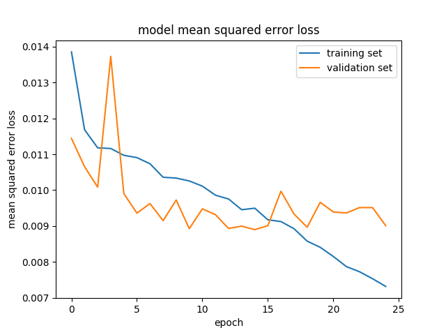

## **Behavioral Cloning** 

---

### 1.Steps

The steps of this project are the following:
* Use the simulator to collect data of good driving behavior
* Build, a convolution neural network in Keras that predicts steering angles from images
* Train and validate the model with a training and validation set
* Test that the model successfully drives around track one without leaving the road
* Summarize the results with a written report

### 2.Dataset

The dataset consists of 24108 images (8036 images per camera angle). Data augmentation is applied by flip the image horizontally (using `np.fliplr()`). 

The data process pipeline is shown below.

The training and validation datasets are splited with a ratio of 4:1. 

### 3.Model Description

The model architecture referenced the pilotNet of NVIDIA, which is shown below:

| Layer         		|     Description	        					| 
|:---------------------:|:---------------------------------------------:| 
| Input         		| 160x320x3 RGB image   						| 
| Cropping2D     	    | cropping=((50, 20), (0, 0))	                |
| Resize                | outputs 66x200x3 RGB image                    |
| Normalization         | net = net/127.5 - 1.                          |
| Convolution 5x5		| 2x2 stride, valid padding, outputs 31x98x24	|
| RELU	      	        | 				                                |
| Convolution 5x5	    | 2x2 stride, valid padding, outputs 14x47x36   |
| RELU					|												|
| Convolution 5x5	    | 2x2 stride, valid padding, outputs 5x22x48    |
| RELU  	      	    |  			                                    |
| Convolution 3x3	    | 1x1 stride, valid padding, outputs 3x20x64    |
| RELU					|												|
| Convolution 3x3	    | 1x1 stride, valid padding, outputs 1x18x64    |
| RELU	      	        |              			                        |
| Convolution 3x3	    | 1x1 stride, same padding, outputs 4x4x32      |
| RELU	      	        |              			                        |
| Fully connected		| outputs 1164 classes                          |
| RELU	      	        |              			                        |
| Dropout	      	    | Dropout 0.5       			                |
| Fully connected       | outputs 100 classes                           |
| RELU	      	        |              			                        |
| Dropout	      	    | Dropout 0.5       			                |
| Fully connected       | outputs 10 classes                            |
| RELU	      	        |              			                        |
| Dropout	      	    | Dropout 0.5       			                |
| Fully connected       | outputs 1 classes                             |
| Tanh	      	        |              			                        |

### 4.Training

In training process, Adam optimizer was chosen because of its faster convergence and reduced oscillation. Batch size is 32 and total epochs is 50. Earlystop is applied with `val_loss` as monitor in order to get the model that could be generalized to the validation data set.

The loss curves for training and validation data set are shown as following:

### 5.Result

The testing video for Track 1 is shown below:

### 6.Possible Improvements

* The model should be generalized to be able to run on Track 2 in the simulator. The model is currently available only in Track 1 because data has not been collected on Track 2. In the future, data should be expanded with that from Track 2.
* When driving a car, we change steering angles based on the traffic/road conditions in few seconds rather than on instantaneous driving decisions. Therefore, it would be interesting to see how models such as LSTM and GRU perform in this problem.
